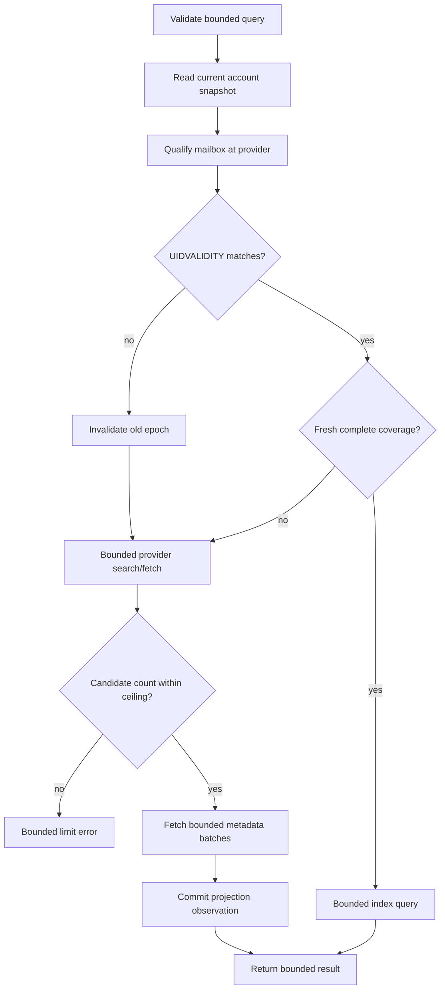

# 06. Mail Read Model and Metadata Index

## Authority and Scope

IMAP is authoritative for mailbox membership, placement, flags, and message
metadata. SQLite is a bounded projection that can reduce provider work. It is
never a complete offline mailbox and may be rebuilt without changing provider
truth.

Read workflows are mailbox discovery, metadata listing/search, body retrieval,
and attachment materialization. Each begins from a current operational account
snapshot and uses late credential resolution from spec 05.

## Mailbox Discovery

The public mailbox value contains only:

- canonical provider mailbox name;
- hierarchy delimiter when supplied;
- provider flags or attributes as bounded strings.

IMAP LIST does not prove UIDVALIDITY, UIDNEXT, message count, or observation time,
so those values MUST NOT be represented as discovery facts. They belong to a
separate selected-mailbox metadata observation when explicitly queried.

Mailbox discovery enforces both a count ceiling and aggregate normalized byte
ceiling. A provider response exceeding either is rejected or explicitly
truncated according to the public contract; it is never accumulated without
bound. LIST records are parsed as protocol-framed responses: tagged completion
text is not a mailbox, `{N}` and `~{N}` mailbox literals are reassembled only at
their exact declared byte length, and malformed or incomplete literals fail the
request. Special-use attributes are matched case-insensitively. Mailbox names are
treated as data and quoted safely for later commands.

## Durable Placement and Qualification

A projection placement key is:

```text
account ID + canonical mailbox + UIDVALIDITY + UID
```

Before using cached rows, the service qualifies the logical mailbox with current
provider state. UIDVALIDITY mismatch invalidates the prior epoch before its rows
can answer the request. The current public numeric email ID remains a
compatibility UID-like value and is not advertised as epoch-bound provenance.

A logical mailbox observation records bounded qualification and coverage data,
such as current UIDVALIDITY, observation time, highest covered UID/range, and
whether the relevant query domain is complete. These are metadata-index facts,
not fields promised by mailbox LIST.

## Coverage and Exactness

An exact total or absence conclusion may come from the projection only when:

1. account and logical mailbox match;
2. current UIDVALIDITY matches the projected epoch;
3. freshness is within configured policy;
4. coverage is complete for the requested filter and range;
5. no stale marker overlaps the requested domain.

Otherwise the service queries IMAP, returns a provider-qualified result, and
updates the projection only with evidence actually observed. Partial scans,
bounded windows, failed refreshes, or interrupted fetches never delete rows by
absence and never produce an exact total claim.

## Metadata Query Flow



Provider candidate identifiers are canonicalized, deduplicated, sorted where
required, and rejected above a strict ceiling before metadata fetch. Basic IMAP
SEARCH has the documented pre-cardinality residual: it receives a command
deadline and its complete UID response is size/count checked immediately before
any further work.

Headers, address lists, subjects, snippets, flags, provider errors, and aggregate
serialized results each have limits. RFC 5322 To and Cc fields are parsed as
structured address fields rather than split on commas, so quoted display names
and group syntax preserve and flatten their actual mailbox entries. Oversized
fields are rejected or truncated with an explicit marker according to their
contract; silent unlimited copying is forbidden.

Every IMAP SEARCH criterion preserves caller text without changing its semantics.
ASCII values use an atom/astring only when permitted by the complete IMAP
grammar and otherwise use a quoted string with exact quote and backslash
escaping. Non-ASCII values use synchronizing UTF-8 literals with `CHARSET UTF-8`;
each literal waits for its own continuation, and a definitive rejection sends no
remaining literal bytes. Cancellation, timeout, or transport failure while a
synchronizing command is in flight aborts the connection because its framing can
no longer be reused safely. IMAP dates use fixed English month tokens and never
depend on the process locale.

## Body Retrieval

Body reads:

- accept a bounded non-empty identifier collection, with a public maximum of 500
  and potentially stricter aggregate limits;
- preserve caller order and return per-item typed outcomes;
- use IMAP PEEK semantics and do not mark messages read as a side effect;
- enforce a running UTF-8 body-byte budget in the provider adapter before each
  result is retained, then independently revalidate per-message and aggregate
  bytes at the application response boundary;
- return a bounded body window selected by a caller offset and maximum length,
  appending an explicit truncation marker only when content past the window
  remains; an explicit maximum is bounded by the public ceiling, while the
  documented unlimited request returns the whole body from the offset with no
  marker and remains bounded by the per-message and aggregate body byte budgets
  rather than by a character window;
- convert an HTML-only body to plain text with the standard library parser,
  without a third-party HTML tree builder and without rendering or executing the
  message: suppressed `script`/`style`/`head` content, preserved block, list,
  table, and blockquote structure, and link targets surfaced only when they add
  information and only after scheme checking with embedded control characters
  removed, so anchor-only, `mailto:`, and `javascript:` targets are never emitted;
- expose nullable `In-Reply-To` and `References` observations only in the
  full-content response, not metadata listing or the SQLite projection;
- return each parsed thread header as one decoded, unfolded string with folding
  spaces and tabs normalized to a single space; missing or whitespace-only values
  become null, duplicate invalid headers use the parser's first observation, and
  malformed non-folding controls remain untrusted observations that compose
  validation may reject;
- do not claim Message-ID-list syntax validation or silently truncate a chain;
- limit each returned thread header to the shared 64 KiB header ceiling and count
  both toward the 4 MiB aggregate returned-header budget, enforcing the running
  budget before provider-adapter retention and revalidating it at the application
  response boundary;
- prune an entire MIME attachment subtree, including every encapsulated
  `message/rfc822` part, so a forwarded message body is never promoted into the
  containing message body;
- decode text parts independently and fall back to UTF-8 with replacement for an
  unknown or invalid declared charset, so one bad part cannot hide the rest of a
  readable message;
- sanitize decode/parser errors and never persist bodies, thread headers from
  full-content reads, or raw MIME in SQLite.

Marking read is a separate mutation under spec 07.

## Attachment Retrieval and Destination Selection

Attachment materialization is an explicit local filesystem effect. The caller
may supply an exact destination path. Compatibility requires preserving an
explicit path; the service MUST NOT silently rewrite it into an approved
workspace, rename it, or append a provider filename.

When the caller omits the destination, the local artifact adapter resolves the
current user's Downloads location and uses an `mcp-email-server` subdirectory
beneath it, creating that child with private permissions when absent. It
derives a bounded safe leaf name from the selected attachment name and adds a
cryptographically random suffix before filesystem
preflight. Provider-controlled path components, traversal, device names, and
platform-invalid characters are never used verbatim. The resolved absolute path
is fixed before provider construction and is used unchanged for the later write.
Failure to resolve or validate the default directory fails before provider work;
the adapter never weakens its platform profile or falls back to the process
working directory.

The effect is permitted only when:

1. attachment retrieval is explicitly enabled by current policy;
2. account authority and policy are freshly revalidated;
3. account, mailbox, message, and MIME part identifiers are valid and bounded;
4. declared and actual bytes fit per-attachment and aggregate ceilings;
5. filesystem capability preflight succeeds before provider fetch, so an
   unsupported destination cannot trigger download or decode work;
6. the provider never receives or interprets the local path;
7. every existing path component and final target passes platform no-follow
   checks while pinned against deletion/replacement where the platform permits;
8. symlink, Windows junction/mount/provider reparse point, non-regular target,
   unsafe ownership/permissions or DACL, unexpected hard link, directory
   substitution, and replacement races are rejected;
9. bytes are written with private owner access using an atomic/no-clobber
   strategy consistent with the declared overwrite contract;
10. final identity, type, owner, permissions or DACL, link count, and size are
    revalidated before success is returned.

On Windows this effect is supported only on local fixed NTFS storage under spec 08.

It creates a random same-directory sibling exclusively with a protected private
DACL, writes through a held non-reparse handle, calls
`FlushFileBuffers`, and replaces with
`MoveFileExW(MOVEFILE_REPLACE_EXISTING | MOVEFILE_WRITE_THROUGH)` when overwrite
is allowed. `MOVEFILE_COPY_ALLOWED` is forbidden. The target is reopened with
reparse traversal disabled and must have the temporary object's recorded volume
serial/file-index identity and expected size. Failure before replacement
preserves an existing target. Cleanup deletes only a verified object created by
the operation; a crash remnant is eligible only for the bounded prefix-, owner-,
DACL-, type-, and identity-validated cleanup in spec 08.

The result reports the exact explicit or resolved destination in a bounded
local-only response. Logs and remote/provider errors do not include it. Partial
files are removed when their identity can be proven; otherwise the operation
returns a bounded cleanup warning without deleting an unverified path.

## Index Writes and Failures

Projection writes occur after provider reads and outside provider sessions when
possible. In both modes, a validated provider-qualified result remains usable if
subsequent projection persistence fails; the response adds the fixed bounded
`projection_write_failed` warning without exception detail. Projection open/read
failures before usable provider evidence still follow the mode-specific
fail-closed/fallback rules. Busy, corrupt, insecure, or incompatible index state
never causes fabricated cached data or legacy-mode fallback.

Retention limits rows, header bytes, accounts/mailboxes per maintenance pass,
and deletion batches. Rebuild affects only projection tables and never managed
catalog authority or secret binding state.

## Acceptance Criteria

1. Mailbox discovery is bounded by count and aggregate bytes and exposes only
   name, delimiter, and attributes.
2. UIDVALIDITY changes prevent prior-epoch rows from answering current queries.
3. Exact totals require fresh qualified complete coverage; partial absence never
   deletes or proves absence.
4. Candidate UID count, fetch batches, headers, bodies, parser work, errors, and
   serialized results have enforced ceilings, including direct service calls.
5. Body reads use PEEK, preserve input order, and return per-item outcomes for up
   to the documented limit without persisting content or reply-thread headers;
   tests cover present, absent, whitespace-only, folded, duplicate, malformed,
   per-field, and aggregate `In-Reply-To`/`References` behavior.
6. Body window tests cover the default window, explicit windows at both ends of
   the public range, rejection above it, the unlimited request expressed as zero
   and as an absent value, offset paging with and without a limit, and the
   truncation marker appearing only when content past the window remains. HTML
   fallback tests cover suppressed elements, structural markers, useful and
   suppressed link targets, and control-character-obfuscated schemes.
7. Attachment tests cover explicit enablement, exact explicit-path
   preservation, default Downloads/application-child resolution, safe
   randomized leaf naming, size limits, capability preflight before provider
   work, symlinks, Windows junctions and other reparse points, hard links,
   non-regular targets, permissions/DACLs, no-clobber/overwrite, concurrent and
   crash-boundary replacement, validated partial/stale cleanup, final identity,
   and absence of path leakage to provider. Windows filesystem cases run on real
   NTFS rather than mocks alone.
8. Projection failure cannot turn known provider read evidence into a false mail
   failure, and rebuild cannot alter catalog or credential state.
9. Interoperability tests cover quoted and grouped address fields, attachment
   subtree pruning, unknown MIME charsets, all English IMAP month tokens, exact
   ASCII astring escaping, multi-literal UTF-8 SEARCH continuations and failure
   framing, LIST completion filtering and literal lengths, and case-insensitive
   special-use attributes.
